    # From the above link download the train.csv file and save it to the same location as your iPython Notebooks.
    # Link: https://www.kaggle.com/c/titanic-gettingStarted
    
    #let's open our titanic project data with pandas
    import pandas as pd
    from pandas import Series,DataFrame
    
    #Now set up the Titanic csv file as a DataFrame
    titanic_df = pd.read_csv('C:/Users/rt/Anaconda/train.csv')
    
    #Now let's display the first few element of the data
    titanic_df.head()

<table border="1" class="dataframe">
  <thead>
    <tr style="text-align: right;">
      <th></th>
      <th>PassengerId</th>
      <th>Survived</th>
      <th>Pclass</th>
      <th>Name</th>
      <th>Sex</th>
      <th>Age</th>
      <th>SibSp</th>
      <th>Parch</th>
      <th>Ticket</th>
      <th>Fare</th>
      <th>Cabin</th>
      <th>Embarked</th>
    </tr>
  </thead>
  <tbody>
    <tr>
      <th>0</th>
      <td>1</td>
      <td>0</td>
      <td>3</td>
      <td>Braund, Mr. Owen Harris</td>
      <td>male</td>
      <td>22</td>
      <td>1</td>
      <td>0</td>
      <td>A/5 21171</td>
      <td>7.2500</td>
      <td>NaN</td>
      <td>S</td>
    </tr>
    <tr>
      <th>1</th>
      <td>2</td>
      <td>1</td>
      <td>1</td>
      <td>Cumings, Mrs. John Bradley (Florence Briggs Th...</td>
      <td>female</td>
      <td>38</td>
      <td>1</td>
      <td>0</td>
      <td>PC 17599</td>
      <td>71.2833</td>
      <td>C85</td>
      <td>C</td>
    </tr>
    <tr>
      <th>2</th>
      <td>3</td>
      <td>1</td>
      <td>3</td>
      <td>Heikkinen, Miss. Laina</td>
      <td>female</td>
      <td>26</td>
      <td>0</td>
      <td>0</td>
      <td>STON/O2. 3101282</td>
      <td>7.9250</td>
      <td>NaN</td>
      <td>S</td>
    </tr>
    <tr>
      <th>3</th>
      <td>4</td>
      <td>1</td>
      <td>1</td>
      <td>Futrelle, Mrs. Jacques Heath (Lily May Peel)</td>
      <td>female</td>
      <td>35</td>
      <td>1</td>
      <td>0</td>
      <td>113803</td>
      <td>53.1000</td>
      <td>C123</td>
      <td>S</td>
    </tr>
    <tr>
      <th>4</th>
      <td>5</td>
      <td>0</td>
      <td>3</td>
      <td>Allen, Mr. William Henry</td>
      <td>male</td>
      <td>35</td>
      <td>0</td>
      <td>0</td>
      <td>373450</td>
      <td>8.0500</td>
      <td>NaN</td>
      <td>S</td>
    </tr>
  </tbody>
</table>

    #Let's get the information of the data by using info() method
    titanic_df.info()

    <class 'pandas.core.frame.DataFrame'>
    Int64Index: 891 entries, 0 to 890
    Data columns (total 12 columns):
    PassengerId    891 non-null int64
    Survived       891 non-null int64
    Pclass         891 non-null int64
    Name           891 non-null object
    Sex            891 non-null object
    Age            714 non-null float64
    SibSp          891 non-null int64
    Parch          891 non-null int64
    Ticket         891 non-null object
    Fare           891 non-null float64
    Cabin          204 non-null object
    Embarked       889 non-null object
    dtypes: float64(2), int64(5), object(5)
    memory usage: 90.5+ KB
    

    # Let's try to answer few basic questions.
    # 1.) Who were the passengers on the Titanic? 
    # 2.) What deck were the passengers on and how does that relate to their class?
    # 3.) Where did the passengers come from?
    # 4.) Who was alone and who was with family?
    # 5.) What factors helped someone survive the sinking?
    
    #We will start by importing what we'll need for the analysis and visualization
    import numpy as np
    import matplotlib.pyplot as plt
    import seaborn as sns
    %matplotlib inline

    # We could first check the gender
    sns.factorplot('Sex',data=titanic_df,kind='count')

    <seaborn.axisgrid.FacetGrid at 0x1774ada0>

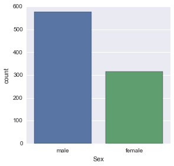

    # Let's seperate the genders by classes by using hue argument!
    sns.factorplot('Pclass',data=titanic_df,hue='Sex',kind='count')

    <seaborn.axisgrid.FacetGrid at 0x177a4470>

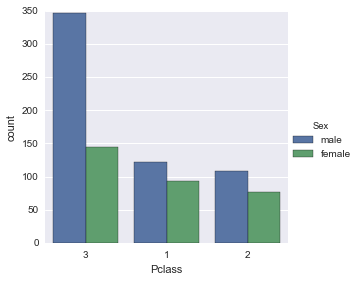

We will try to find some more information like the split between males,females,and children.

    # Let's make a function to sort through the sex 
    def male_female_child(passenger):
        # Take the Age and Sex
        age,sex = passenger
        # Compare the age, otherwise leave the sex
        if age < 16:
            return 'child'
        else:
            return sex
        
    
    # We'll define a new column called 'person', remember to specify axis=1 for columns and not index
    titanic_df['person'] = titanic_df[['Age','Sex']].apply(male_female_child,axis=1)

    # We will checkout the first ten rows
    titanic_df[0:10]

<table border="1" class="dataframe">
  <thead>
    <tr style="text-align: right;">
      <th></th>
      <th>PassengerId</th>
      <th>Survived</th>
      <th>Pclass</th>
      <th>Name</th>
      <th>Sex</th>
      <th>Age</th>
      <th>SibSp</th>
      <th>Parch</th>
      <th>Ticket</th>
      <th>Fare</th>
      <th>Cabin</th>
      <th>Embarked</th>
      <th>person</th>
    </tr>
  </thead>
  <tbody>
    <tr>
      <th>0</th>
      <td>1</td>
      <td>0</td>
      <td>3</td>
      <td>Braund, Mr. Owen Harris</td>
      <td>male</td>
      <td>22</td>
      <td>1</td>
      <td>0</td>
      <td>A/5 21171</td>
      <td>7.2500</td>
      <td>NaN</td>
      <td>S</td>
      <td>male</td>
    </tr>
    <tr>
      <th>1</th>
      <td>2</td>
      <td>1</td>
      <td>1</td>
      <td>Cumings, Mrs. John Bradley (Florence Briggs Th...</td>
      <td>female</td>
      <td>38</td>
      <td>1</td>
      <td>0</td>
      <td>PC 17599</td>
      <td>71.2833</td>
      <td>C85</td>
      <td>C</td>
      <td>female</td>
    </tr>
    <tr>
      <th>2</th>
      <td>3</td>
      <td>1</td>
      <td>3</td>
      <td>Heikkinen, Miss. Laina</td>
      <td>female</td>
      <td>26</td>
      <td>0</td>
      <td>0</td>
      <td>STON/O2. 3101282</td>
      <td>7.9250</td>
      <td>NaN</td>
      <td>S</td>
      <td>female</td>
    </tr>
    <tr>
      <th>3</th>
      <td>4</td>
      <td>1</td>
      <td>1</td>
      <td>Futrelle, Mrs. Jacques Heath (Lily May Peel)</td>
      <td>female</td>
      <td>35</td>
      <td>1</td>
      <td>0</td>
      <td>113803</td>
      <td>53.1000</td>
      <td>C123</td>
      <td>S</td>
      <td>female</td>
    </tr>
    <tr>
      <th>4</th>
      <td>5</td>
      <td>0</td>
      <td>3</td>
      <td>Allen, Mr. William Henry</td>
      <td>male</td>
      <td>35</td>
      <td>0</td>
      <td>0</td>
      <td>373450</td>
      <td>8.0500</td>
      <td>NaN</td>
      <td>S</td>
      <td>male</td>
    </tr>
    <tr>
      <th>5</th>
      <td>6</td>
      <td>0</td>
      <td>3</td>
      <td>Moran, Mr. James</td>
      <td>male</td>
      <td>NaN</td>
      <td>0</td>
      <td>0</td>
      <td>330877</td>
      <td>8.4583</td>
      <td>NaN</td>
      <td>Q</td>
      <td>male</td>
    </tr>
    <tr>
      <th>6</th>
      <td>7</td>
      <td>0</td>
      <td>1</td>
      <td>McCarthy, Mr. Timothy J</td>
      <td>male</td>
      <td>54</td>
      <td>0</td>
      <td>0</td>
      <td>17463</td>
      <td>51.8625</td>
      <td>E46</td>
      <td>S</td>
      <td>male</td>
    </tr>
    <tr>
      <th>7</th>
      <td>8</td>
      <td>0</td>
      <td>3</td>
      <td>Palsson, Master. Gosta Leonard</td>
      <td>male</td>
      <td>2</td>
      <td>3</td>
      <td>1</td>
      <td>349909</td>
      <td>21.0750</td>
      <td>NaN</td>
      <td>S</td>
      <td>child</td>
    </tr>
    <tr>
      <th>8</th>
      <td>9</td>
      <td>1</td>
      <td>3</td>
      <td>Johnson, Mrs. Oscar W (Elisabeth Vilhelmina Berg)</td>
      <td>female</td>
      <td>27</td>
      <td>0</td>
      <td>2</td>
      <td>347742</td>
      <td>11.1333</td>
      <td>NaN</td>
      <td>S</td>
      <td>female</td>
    </tr>
    <tr>
      <th>9</th>
      <td>10</td>
      <td>1</td>
      <td>2</td>
      <td>Nasser, Mrs. Nicholas (Adele Achem)</td>
      <td>female</td>
      <td>14</td>
      <td>1</td>
      <td>0</td>
      <td>237736</td>
      <td>30.0708</td>
      <td>NaN</td>
      <td>C</td>
      <td>child</td>
    </tr>
  </tbody>
</table>

We have seperated the passengers between female,male,and child.

    # Now let's try the factorplot again!
    sns.factorplot('Pclass',data=titanic_df,hue='person',kind='count')

    <seaborn.axisgrid.FacetGrid at 0x18068978>

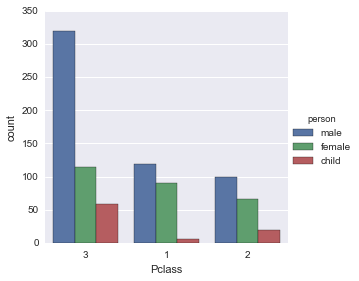

Let's create a distribution of ages to get a more precise picture of the who the passengers were by using histogram

    titanic_df['Age'].hist(bins=70)

    <matplotlib.axes._subplots.AxesSubplot at 0x19c165f8>

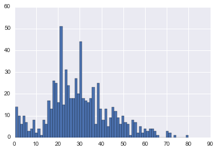

    # We can even get a quick overall comparison of male,female,child by using value_counts method
    titanic_df['person'].value_counts()

    male      537
    female    271
    child      83
    dtype: int64

    # One more way to visualize the data is to use FacetGrid. It allows to plot multiple kedplots on one plot.
    
    # First set the figure equal to a facetgrid with the pandas dataframe as its data source, set the hue, and change the aspect ratio.
    fig = sns.FacetGrid(titanic_df, hue="Sex",aspect=4)
    
    # Next use map to plot all the possible kdeplots for the 'Age' column by the hue choice
    fig.map(sns.kdeplot,'Age',shade= True)
    
    # Set the x max limit by the oldest passenger
    oldest = titanic_df['Age'].max()
    
    #Since we know no one can be negative years old set the x lower limit at 0
    fig.set(xlim=(0,oldest))
    
    #Finally add a legend
    fig.add_legend()

    <seaborn.axisgrid.FacetGrid at 0x1a1ad940>

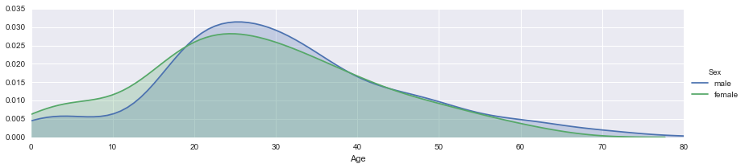

    # We will use the same format for 'person' column to include children:
    
    fig = sns.FacetGrid(titanic_df, hue="person",aspect=4)
    fig.map(sns.kdeplot,'Age',shade= True)
    oldest = titanic_df['Age'].max()
    fig.set(xlim=(0,oldest))
    fig.add_legend()

    <seaborn.axisgrid.FacetGrid at 0x177629e8>

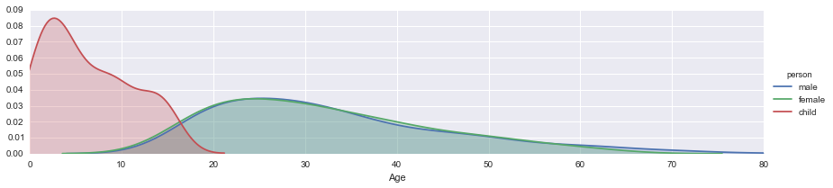

    # Let's do the same for class by changing the hue argument:
    fig = sns.FacetGrid(titanic_df, hue="Pclass",aspect=4)
    fig.map(sns.kdeplot,'Age',shade= True)
    oldest = titanic_df['Age'].max()
    fig.set(xlim=(0,oldest))
    fig.add_legend()

    <seaborn.axisgrid.FacetGrid at 0x1a72d2b0>

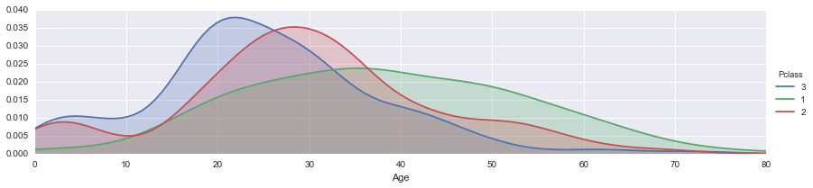

 Let's move on to our 2nd question: What deck were the passengers on and how does that relate to their class?

    titanic_df.head()

<table border="1" class="dataframe">
  <thead>
    <tr style="text-align: right;">
      <th></th>
      <th>PassengerId</th>
      <th>Survived</th>
      <th>Pclass</th>
      <th>Name</th>
      <th>Sex</th>
      <th>Age</th>
      <th>SibSp</th>
      <th>Parch</th>
      <th>Ticket</th>
      <th>Fare</th>
      <th>Cabin</th>
      <th>Embarked</th>
    </tr>
  </thead>
  <tbody>
    <tr>
      <th>0</th>
      <td>1</td>
      <td>0</td>
      <td>3</td>
      <td>Braund, Mr. Owen Harris</td>
      <td>male</td>
      <td>22</td>
      <td>1</td>
      <td>0</td>
      <td>A/5 21171</td>
      <td>7.2500</td>
      <td>NaN</td>
      <td>S</td>
    </tr>
    <tr>
      <th>1</th>
      <td>2</td>
      <td>1</td>
      <td>1</td>
      <td>Cumings, Mrs. John Bradley (Florence Briggs Th...</td>
      <td>female</td>
      <td>38</td>
      <td>1</td>
      <td>0</td>
      <td>PC 17599</td>
      <td>71.2833</td>
      <td>C85</td>
      <td>C</td>
    </tr>
    <tr>
      <th>2</th>
      <td>3</td>
      <td>1</td>
      <td>3</td>
      <td>Heikkinen, Miss. Laina</td>
      <td>female</td>
      <td>26</td>
      <td>0</td>
      <td>0</td>
      <td>STON/O2. 3101282</td>
      <td>7.9250</td>
      <td>NaN</td>
      <td>S</td>
    </tr>
    <tr>
      <th>3</th>
      <td>4</td>
      <td>1</td>
      <td>1</td>
      <td>Futrelle, Mrs. Jacques Heath (Lily May Peel)</td>
      <td>female</td>
      <td>35</td>
      <td>1</td>
      <td>0</td>
      <td>113803</td>
      <td>53.1000</td>
      <td>C123</td>
      <td>S</td>
    </tr>
    <tr>
      <th>4</th>
      <td>5</td>
      <td>0</td>
      <td>3</td>
      <td>Allen, Mr. William Henry</td>
      <td>male</td>
      <td>35</td>
      <td>0</td>
      <td>0</td>
      <td>373450</td>
      <td>8.0500</td>
      <td>NaN</td>
      <td>S</td>
    </tr>
  </tbody>
</table>

    # We will drop the nan values from cabin
    deck = titanic_df['Cabin'].dropna()

    deck.head()

    1      C85
    3     C123
    6      E46
    10      G6
    11    C103
    Name: Cabin, dtype: object

But we will only need the first letter of the deck to classify its level (like A,B,C,D,E,F,G)

    #Let's grab the first letter
    levels = []
    for level in deck:
        levels.append(level[0])  

    # Now reset DataFrame and use factor plot
    cabin_df = DataFrame(levels)
    cabin_df.columns = ['Cabin']
    sns.factorplot('Cabin',data=cabin_df,palette='winter_d',kind='count')

    <seaborn.axisgrid.FacetGrid at 0x1aa37be0>

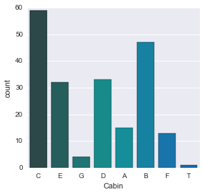

    # Redefine cabin_df as everything but where the row was equal to 'T'
    cabin_df = cabin_df[cabin_df.Cabin != 'T']
    #Replot
    sns.factorplot('Cabin',data=cabin_df,palette='summer',kind='count')

    <seaborn.axisgrid.FacetGrid at 0x1afcde80>

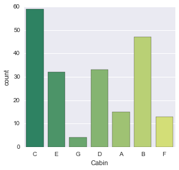

Let's go ahead with our third question
3.) Where did the passengers come from?

    titanic_df.head()

<table border="1" class="dataframe">
  <thead>
    <tr style="text-align: right;">
      <th></th>
      <th>PassengerId</th>
      <th>Survived</th>
      <th>Pclass</th>
      <th>Name</th>
      <th>Sex</th>
      <th>Age</th>
      <th>SibSp</th>
      <th>Parch</th>
      <th>Ticket</th>
      <th>Fare</th>
      <th>Cabin</th>
      <th>Embarked</th>
    </tr>
  </thead>
  <tbody>
    <tr>
      <th>0</th>
      <td>1</td>
      <td>0</td>
      <td>3</td>
      <td>Braund, Mr. Owen Harris</td>
      <td>male</td>
      <td>22</td>
      <td>1</td>
      <td>0</td>
      <td>A/5 21171</td>
      <td>7.2500</td>
      <td>NaN</td>
      <td>S</td>
    </tr>
    <tr>
      <th>1</th>
      <td>2</td>
      <td>1</td>
      <td>1</td>
      <td>Cumings, Mrs. John Bradley (Florence Briggs Th...</td>
      <td>female</td>
      <td>38</td>
      <td>1</td>
      <td>0</td>
      <td>PC 17599</td>
      <td>71.2833</td>
      <td>C85</td>
      <td>C</td>
    </tr>
    <tr>
      <th>2</th>
      <td>3</td>
      <td>1</td>
      <td>3</td>
      <td>Heikkinen, Miss. Laina</td>
      <td>female</td>
      <td>26</td>
      <td>0</td>
      <td>0</td>
      <td>STON/O2. 3101282</td>
      <td>7.9250</td>
      <td>NaN</td>
      <td>S</td>
    </tr>
    <tr>
      <th>3</th>
      <td>4</td>
      <td>1</td>
      <td>1</td>
      <td>Futrelle, Mrs. Jacques Heath (Lily May Peel)</td>
      <td>female</td>
      <td>35</td>
      <td>1</td>
      <td>0</td>
      <td>113803</td>
      <td>53.1000</td>
      <td>C123</td>
      <td>S</td>
    </tr>
    <tr>
      <th>4</th>
      <td>5</td>
      <td>0</td>
      <td>3</td>
      <td>Allen, Mr. William Henry</td>
      <td>male</td>
      <td>35</td>
      <td>0</td>
      <td>0</td>
      <td>373450</td>
      <td>8.0500</td>
      <td>NaN</td>
      <td>S</td>
    </tr>
  </tbody>
</table>

    # We will make new factorplot to check the results
    sns.factorplot('Embarked',data=titanic_df,hue='Pclass',x_order=['C','Q','S'],kind='count')

    <seaborn.axisgrid.FacetGrid at 0x1b331160>

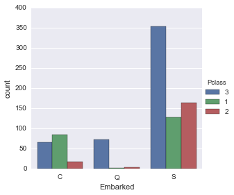

We will now go ahead with our 4th Question

4.) Who was alone and who was with family?

    # We will start by adding new columns
    titanic_df['Alone'] =  titanic_df.Parch + titanic_df.SibSp
    titanic_df['Alone']

    0       1
    1       1
    2       0
    3       1
    4       0
    5       0
    6       0
    7       4
    8       2
    9       1
    10      2
    11      0
    12      0
    13      6
    14      0
    15      0
    16      5
    17      0
    18      1
    19      0
    20      0
    21      0
    22      0
    23      0
    24      4
    25      6
    26      0
    27      5
    28      0
    29      0
           ..
    861     1
    862     0
    863    10
    864     0
    865     0
    866     1
    867     0
    868     0
    869     2
    870     0
    871     2
    872     0
    873     0
    874     1
    875     0
    876     0
    877     0
    878     0
    879     1
    880     1
    881     0
    882     0
    883     0
    884     0
    885     5
    886     0
    887     0
    888     3
    889     0
    890     0
    Name: Alone, dtype: int64

Now we know that if the Alone column is anything but 0, then the passenger had family aboard and wasn't alone.
So let's change the column now so that if the value is greater than 0, we know the passenger was with his/her family, otherwise they were alone.

    # Look for >0 or ==0 to set alone status
    titanic_df['Alone'].loc[titanic_df['Alone'] >0] = 'With Family'
    titanic_df['Alone'].loc[titanic_df['Alone'] == 0] = 'Alone'

    url_info = 'http://stackoverflow.com/questions/20625582/how-to-deal-with-this-pandas-warning'

    # Let's check to make sure it worked
    titanic_df.head()

<table border="1" class="dataframe">
  <thead>
    <tr style="text-align: right;">
      <th></th>
      <th>PassengerId</th>
      <th>Survived</th>
      <th>Pclass</th>
      <th>Name</th>
      <th>Sex</th>
      <th>Age</th>
      <th>SibSp</th>
      <th>Parch</th>
      <th>Ticket</th>
      <th>Fare</th>
      <th>Cabin</th>
      <th>Embarked</th>
      <th>Alone</th>
    </tr>
  </thead>
  <tbody>
    <tr>
      <th>0</th>
      <td>1</td>
      <td>0</td>
      <td>3</td>
      <td>Braund, Mr. Owen Harris</td>
      <td>male</td>
      <td>22</td>
      <td>1</td>
      <td>0</td>
      <td>A/5 21171</td>
      <td>7.2500</td>
      <td>NaN</td>
      <td>S</td>
      <td>With Family</td>
    </tr>
    <tr>
      <th>1</th>
      <td>2</td>
      <td>1</td>
      <td>1</td>
      <td>Cumings, Mrs. John Bradley (Florence Briggs Th...</td>
      <td>female</td>
      <td>38</td>
      <td>1</td>
      <td>0</td>
      <td>PC 17599</td>
      <td>71.2833</td>
      <td>C85</td>
      <td>C</td>
      <td>With Family</td>
    </tr>
    <tr>
      <th>2</th>
      <td>3</td>
      <td>1</td>
      <td>3</td>
      <td>Heikkinen, Miss. Laina</td>
      <td>female</td>
      <td>26</td>
      <td>0</td>
      <td>0</td>
      <td>STON/O2. 3101282</td>
      <td>7.9250</td>
      <td>NaN</td>
      <td>S</td>
      <td>With Family</td>
    </tr>
    <tr>
      <th>3</th>
      <td>4</td>
      <td>1</td>
      <td>1</td>
      <td>Futrelle, Mrs. Jacques Heath (Lily May Peel)</td>
      <td>female</td>
      <td>35</td>
      <td>1</td>
      <td>0</td>
      <td>113803</td>
      <td>53.1000</td>
      <td>C123</td>
      <td>S</td>
      <td>With Family</td>
    </tr>
    <tr>
      <th>4</th>
      <td>5</td>
      <td>0</td>
      <td>3</td>
      <td>Allen, Mr. William Henry</td>
      <td>male</td>
      <td>35</td>
      <td>0</td>
      <td>0</td>
      <td>373450</td>
      <td>8.0500</td>
      <td>NaN</td>
      <td>S</td>
      <td>With Family</td>
    </tr>
  </tbody>
</table>

    # Let's get a simple visualization!
    sns.factorplot('Alone',data=titanic_df,palette='Blues',kind='count')

    <seaborn.axisgrid.FacetGrid at 0x1afed160>

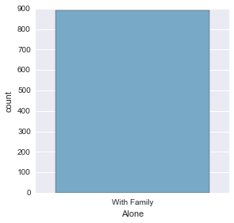

Let's go ahead with our last question
5.What factors helped someone survive the sinking?

    # We will start by creating a new column
    titanic_df["Survivor"] = titanic_df.Survived.map({0: "no", 1: "yes"})
    
    # Let's just get a quick overall view of survied vs died. 
    sns.factorplot('Survivor',data=titanic_df,palette='Set1',kind='count')

    <seaborn.axisgrid.FacetGrid at 0x1805e748>

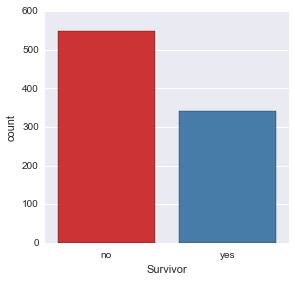

 Let's see if the class of the passengers had an effect on their survival rate, since the movie Titanic popularized the notion that the 3rd class passengers did not do as well as their 1st and 2nd class counterparts.

    # Now let's use a factor plot again, but now considering class
    sns.factorplot('Pclass','Survived',data=titanic_df)

    <seaborn.axisgrid.FacetGrid at 0x18072780>

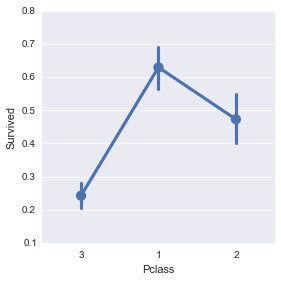

We will now check: Did being younger or older have an effect on survival rate?

    # Let's use a linear plot on age versus survival
    sns.lmplot('Age','Survived',data=titanic_df)

    <seaborn.axisgrid.FacetGrid at 0x1b48d668>

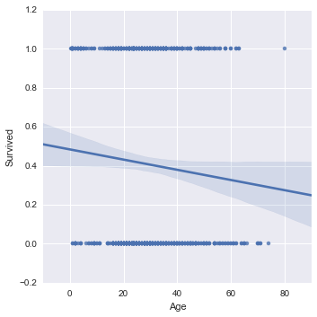

    # Let's use a linear plot on age versus survival using hue for class seperation
    sns.lmplot('Age','Survived',hue='Pclass',data=titanic_df,palette='winter')

    <seaborn.axisgrid.FacetGrid at 0x1bc30e10>

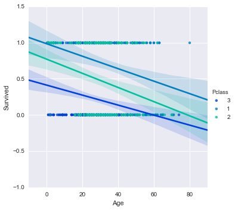

We can also use the x_bin argument to clean up this figure and grab the data and bin it by age with a std attached!

    # Let's use a linear plot on age versus survival using hue for class seperation
    generations=[10,20,40,60,80]
    sns.lmplot('Age','Survived',hue='Pclass',data=titanic_df,palette='winter',x_bins=generations)

    <seaborn.axisgrid.FacetGrid at 0x1beb04e0>

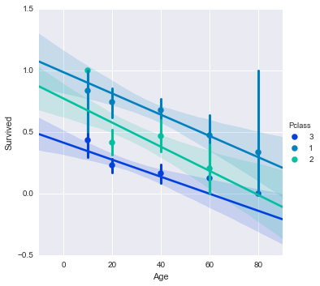

 What about if we relate gender and age with the survival set?

    sns.lmplot('Age','Survived',hue='Sex',data=titanic_df,palette='winter',x_bins=generations)

    <seaborn.axisgrid.FacetGrid at 0x1c014630>

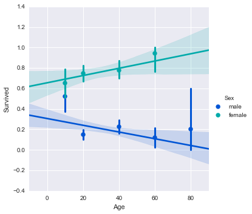

Finally we are done. I will leave this project with my fav scene from titanic

    from IPython.display import Image
    Image(url='http://i.imgur.com/DGNjT.gif')

    
